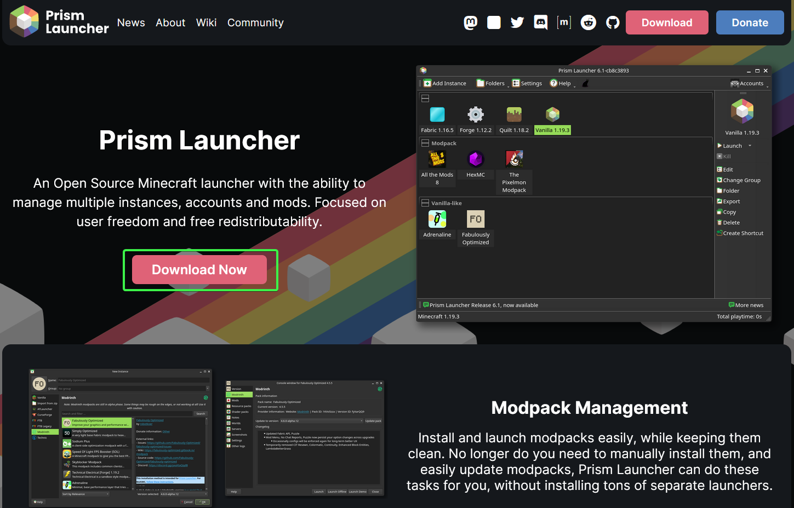
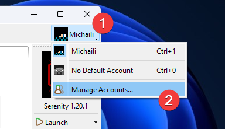
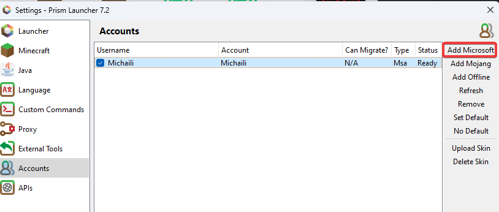
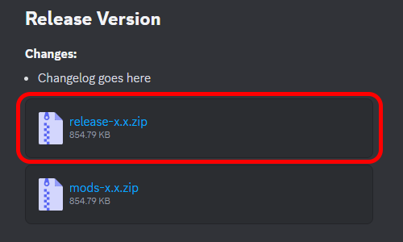
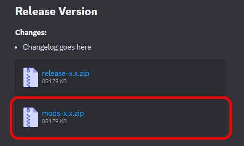

# Installation

## 1. Installing Prism Launcher

### Downloading the Launcher

1. Go to the [Prism Launcher website](https://prismlauncher.org/) and hit the
   download button:\
   

2. Download the installer and follow its instructions.

### Logging into your Minecraft account

1. Open the Prism Launcher, click on the Minecraft Skin icon on the top right,
   and hit "Manage Accounts"\
  

2. Hit "Add Microsoft" and follow the instructions to log in with your
   Microsoft account.\
  

## 2. Installing the Modpack

### Downloading the Modpack

1. Download the latest release ZIP file from the `#releases` channel in the Boundless SMP Discord:\
   
   
2. Drag and drop the ZIP file into Prism Launcher.

3. Hit OK at the bottom right.

You're now good to go! Double-click the modpack (or hit the launch button) to start.

# Updating

## 1. Downloading And Installing Updates To The Modpack

### Downloading & installing the updated mod list

1. Download the latest mods ZIP file from the `#releases` channel in the Boundless SMP Discord:\
   

2. Open the folder where your mods are currently installed. 
    - In Prism Launcher, this can be accessed via clicking **Edit -> Mods -> View Folder**.

3. Open the `mods.zip` file with any ZIP software of your choosing (e.g. WinRAR, 7Zip, etc.).

4. Drag the contents of the `mods` folder (i.e. the JAR files inside it) into the folder containing your currently installed mods.  
    - If asked, replace any existing files with the ones you've just dragged in.
